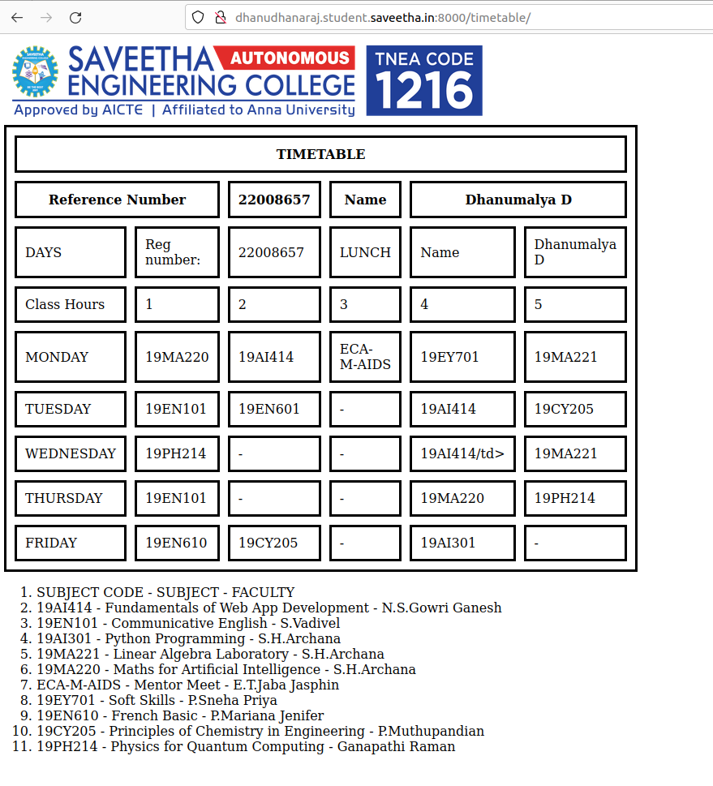
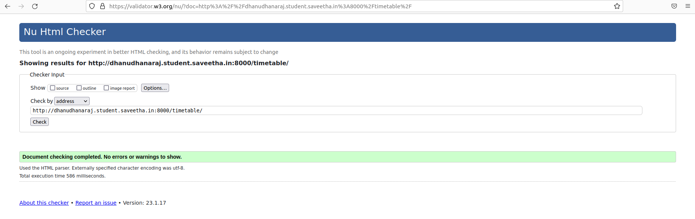

# Experiment_Time_Table

## AIM
To Write a html webpage page to display your timetable.

# ALGORITHM
### STEP 1
Create a simple table using table tag
### STEP 2
Add header row using the tag
### STEP 3
Add your timetable
### STEP 4
Execute the program

# CODE :
```
<!DOCTYPE html>
<html lang="en">
<head>
  <title>TIMETABLE</title>
   <style>
    table {
      width: 700px;
      border-spacing: 10px;
      border: 3px solid;
    }

     td, th {
      border: 3px solid;
      padding: 10px;
    }
  </style>
  
</head>
<body>
   
    
   <table> 
    <tr>
      <th colspan="6">TIMETABLE</th>
    </tr>
    <tr>
      <th colspan="2" >Reference Number</th>
      <th>22008657</th>
      <th>Name</th>
      <th colspan="2">Dhanumalya D</th>
    </tr>
        <tr>
           <td>DAYS</td>
           <td> Reg number: </td>
           <td> 22008657 </td>
           <td>LUNCH</td>
           <td>Name</td>
           <td>Dhanumalya D</td>
        </tr>
        <tr>
            <td>Class Hours</td>
            <td>1</td>
            <td>2</td>
            <td>3</td>
            <td>4</td>
            <td>5</td>
        </tr>
                <tr>
            <td>MONDAY</td>
            <td>19MA220</td>
            <td>19AI414</td>
            <td>ECA-M-AIDS</td>
            <td>19EY701</td>
            <td>19MA221</td>
        </tr>
                 <tr>
            <td>TUESDAY</td>
            <td>19EN101</td>
            <td>19EN601</td>
            <td>-</td>
            <td>19AI414</td>
            <td>19CY205</td>
        </tr>
                 <tr>
            <td>WEDNESDAY</td>
            <td>19PH214</td>
            <td>-</td>
            <td>-</td>
            <td>19AI414/td>
            <td>19MA221</td>
        </tr>
        <tr>
            <td>THURSDAY</td>
            <td>19EN101</td>
            <td>-</td>
            <td>-</td>
            <td>19MA220</td>
            <td>19PH214</td>
        </tr>
        <tr>
            <td>FRIDAY</td>
            <td>19EN610</td>
            <td>19CY205</td>
            <td>-</td>
            <td>19AI301</td>
            <td >-</td>
        </tr>
    </table>
    <ol>
        <li>SUBJECT CODE - SUBJECT - FACULTY</li>
        <li>19AI414 - Fundamentals of Web App Development - N.S.Gowri Ganesh</li>
        <li>19EN101 - Communicative English - S.Vadivel</li>
        <li>19AI301 - Python Programming - S.H.Archana</li>
        <li>19MA221 - Linear Algebra Laboratory - S.H.Archana</li>
        <li>19MA220 - Maths for Artificial Intelligence - S.H.Archana</li>
        <li>ECA-M-AIDS - Mentor Meet - E.T.Jaba Jasphin</li>
        <li>19EY701 - Soft Skills - P.Sneha Priya</li>
        <li>19EN610 - French Basic - P.Mariana Jenifer</li>
        <li>19CY205 - Principles of Chemistry in Engineering - P.Muthupandian</li>
        <li>19PH214 - Physics for Quantum Computing - Ganapathi Raman</li>
    </ol>
</body>
</html>
```

# OUTPUT :


# NU HTML CHECKER:


# RESULT :
Thus the timetable is displayed in the webpage.

